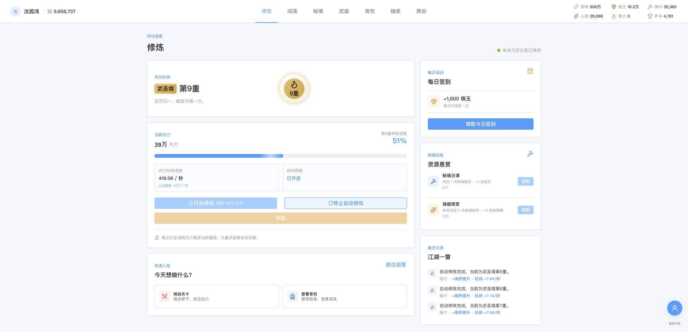
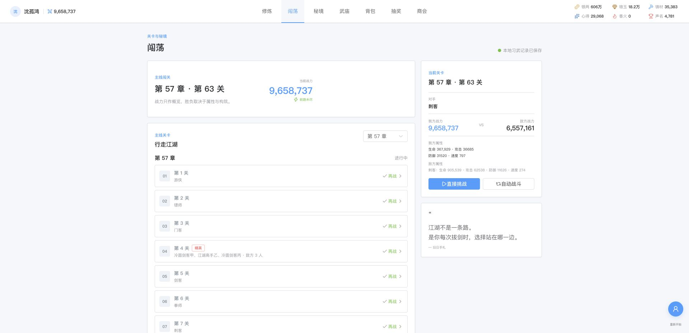
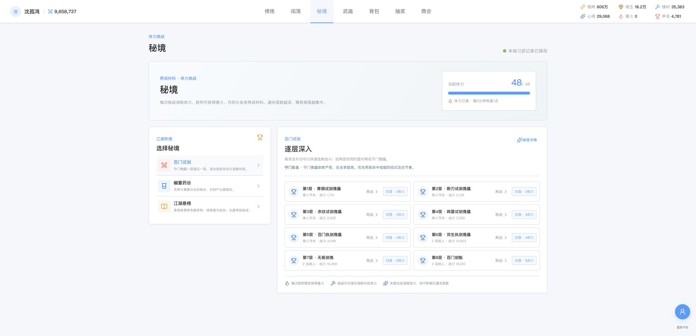
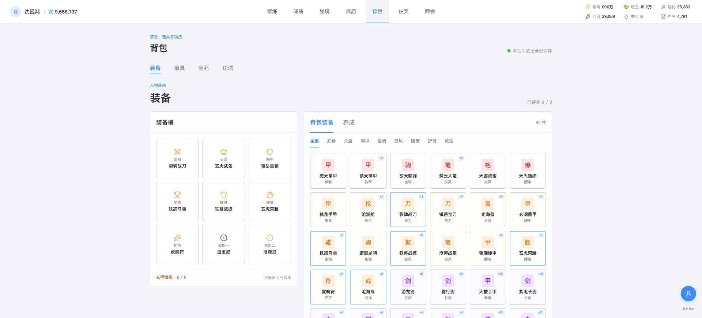
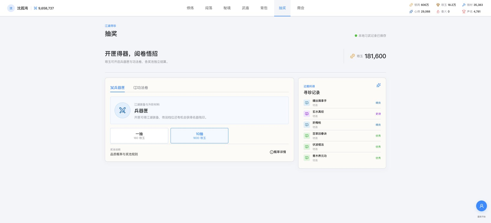

# 山河问武 / Wanderer's Path

> 一款单主角武侠挂机养成游戏。吐纳不止是等待，境界、装备、功法与战斗构筑共同决定你能走多远。

**在线体验：** [wuxia.drowts.cn](https://wuxia.drowts.cn)



## 这是一段怎样的江湖

从炼体起步，以内力推动打坐进度，逐重修炼，直至武道极境。主线没有把战力当作胜负判定：速度决定出手先后，命中与闪避决定攻防博弈，怒气循环与内外功搭配决定关键回合的爆发。你可以轻松挂机，也可以在卡关时调配装备、套装、宝石和功法，寻找更合适的打法。

```text
吐纳内力 -> 修炼境界 -> 闯荡主线 -> 获取资源
    ^                                  |
    |                                  v
武庙供奉 <- 秘境挑战 <- 装备、功法与材料养成
```

## 修炼不是单纯等数值

内力持续自动增长。手动打坐或自动修炼会消耗内力推进当前重数，九重圆满后由玩家亲自突破。境界成长提高基础面板与吐纳效率，但越往后，单靠挂机越难跨越瓶颈，需要用其他系统补足成长速度。


## 主线：让构筑而不是总战力说话

主线按章节推进，普通关、精英关与多敌人战斗逐步提高策略密度。已通关关卡可以重战，当前关卡始终固定在右侧，支持直接挑战与自动闯荡。战斗采用按速度排序的回合序列，完整包含命中、闪避、暴击、连击、反击、眩晕、吸血和怒气外功。



## 秘境：养成材料的稳定来源

秘境使用体力而不是每日次数限制。三条路线分别偏向战斗检验、丹药积累与综合掉落；挑战或扫荡均能获得香火、丹药、宝石、装备、功法和各类培养材料。体力每 5 分钟恢复 1 点，上限随境界提升。



## 装备、功法与构筑空间

九个装备槽位覆盖武器、头盔、胸甲、坐骑、披风、腰带、护符与双戒指。高阶装备可组成六件套，三件起获得套装效果，集齐后取得最强的构筑收益。装备还支持强化、洗炼、升阶，以及最多四个互不重复的宝石孔。

功法分为内功和外功：两本内功提供属性与被动效果，两本外功依怒气轮替施放。武器与外功不强制绑定，使用对应兵器时会额外获得独立乘算的加成。



## 江湖寻珍

兵器匣与功法卷独立结算，使用琅玉进行单抽或十连。抽取结果以翻牌形式逐张揭示，重复装备和功法会完整保留，可作为后续升阶材料。品质划分为普通、优秀、精良、史诗、传说与神话。



> 截图来自开发存档，用于展示成熟阶段的玩法界面；实际成长从基础境界与初始资源开始。

## 主要系统

- **修炼与境界**：内力吐纳、手动/自动打坐、九重修炼与突破，覆盖十个大境界。
- **闯荡与战斗**：章节化关卡、多敌人精英关、重复挑战、自动闯荡与回合战斗日志。
- **秘境与武庙**：体力挑战、扫荡、养成材料掉落，以及香火供奉五座神像。
- **装备养成**：九个穿戴槽、品质、套装、强化、洗炼、升阶、宝石镶嵌与宝石合成。
- **功法养成**：内外功装配、怒气循环、主动效果、兵器契合、强化与升阶。
- **资源循环**：银两、琅玉、铸材、心得、精魄、洗炼石、宝石、丹药等都有明确消耗场景与产出途径。
- **本地存档**：进度保存在浏览器 `localStorage`，包含版本迁移与异常存档恢复处理。

## 技术栈

- Vue 3 + TypeScript
- Vite
- Element Plus
- Lucide Vue
- Vitest

## 本地开发

要求 Node.js 20 或更高版本。

```bash
npm install
npm run dev
```

若需要固定端口：

```bash
npm run dev -- --port 5174
```

常用校验命令：

```bash
npm run typecheck
npm test
npm run build
```

生产构建产物位于 `dist/`。本项目是纯前端单页应用，不需要 Node 服务端常驻进程或数据库。

## 内容与规则

```text
src/
  components/       页面、弹窗和交互组件
  data/             JSON 游戏内容、数值配置及其校验适配层
    realms.json       境界与修炼参数
    equipment.json    装备、部位与套装配置
    martial-arts.json 功法配置
    items.json        道具、丹药、宝石与材料配置
    lottery.json      奖池、概率与抽取配置
    dungeons.json     秘境层数、敌人、掉落与体力配置
    main-story.json   主线章节、关卡、敌人与奖励配置
    silver-shop.json  商会商品配置
    temple.ts         武庙神像配置
  domain/           纯业务规则：修炼、战斗、掉落、存档和数值计算
  App.vue            游戏状态编排
  styles.css         全局视觉与响应式样式
test/
  domain.test.ts     内容完整性、数值规则、存档迁移与玩法回归测试
```

`data/` 仅保存可配置内容及其运行时校验；`domain/` 负责计算、状态推进和存档兼容。新增装备、功法、道具、关卡或秘境内容时，优先修改对应 JSON，而非将数据写入业务逻辑。

### 核心数值约定

- 秘境体力每 5 分钟恢复 1 点；上限随境界从 24 提升至 48。
- 神像属于独立基础属性乘算区：`境界基础属性 × 神像倍率 × 其他百分比倍率 + 固定属性`。
- 武庙的归息神像提供固定吐纳速度，不与百分比倍率混算。
- 抽奖使用琅玉，单抽为 160 琅玉，仅支持单抽与十连。

## 静态部署

构建后将 `dist/` 中的文件发布到任意静态 Web 服务即可。以 Nginx 为例：

```nginx
server {
  listen 80;
  server_name game.example.com;

  root /var/www/wuxia-idle;
  index index.html;

  location / {
    try_files $uri $uri/ /index.html;
  }
}
```

发布流程：

```bash
npm ci
npm run build
rsync -av --delete dist/ deploy@your-server:/var/www/wuxia-idle/
```

注意：`rsync --delete` 会删除服务器目标目录中不在本次构建产物内的文件。部署前请确认目标目录只存放本项目静态文件。

项目同时提供了面向 `wuxia.drowts.cn` 的配置模板：首次签发证书时使用 `deploy/nginx/wuxia-idle.http.conf`，签发后切换为 `deploy/nginx/wuxia-idle.https.conf`。发布目录采用 `releases/` 与 `current` 软链接，便于回滚。

## 存档说明

游戏进度仅保存在当前浏览器和当前站点域名下。清除浏览器站点数据、更换浏览器或更换域名都会创建新的本地存档；当前版本不包含账号登录或云端存档。
